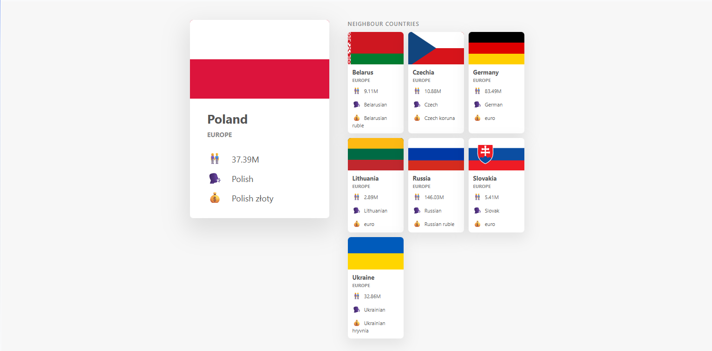
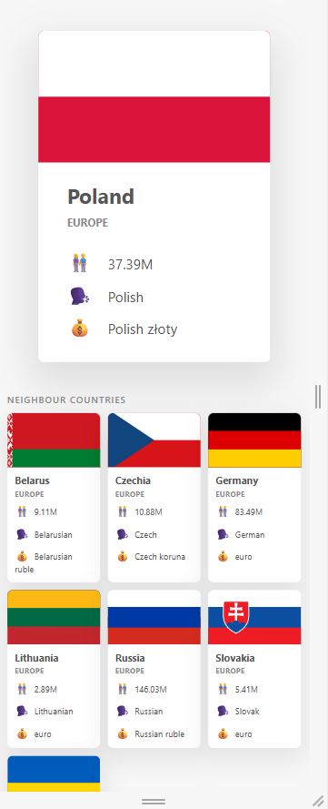

# 🌍 Where Am I? - Country Explorer

> A vanilla JavaScript app that detects your location and displays country info with all neighbouring countries — fetched live from a REST API.

---

## 🚀 Live Demo

> Open `index.html` in any static server, e.g.:
> ```
> npx serve .
> ```
> or
> ```
> python3 -m http.server 8080
> ```

---

## 📸 Preview

> 
> 
> 

---

## ✨ Features

### 🗺️ Location Detection
- Click **"Where am I?"** to auto-detect your country via IP geolocation
- No browser permission required — uses [BigDataCloud Reverse Geocoding API](https://www.bigdatacloud.com/geocoding-apis/free-reverse-geocode-to-city-api)

### 🔍 Country Search
- Search any country by name — supports both **English** and **Polish** names
- Press **Enter** or click **Search** to trigger
- Fallback: tries `/name/` first, then `/translation/` if not found

### 🏳️ Country Card
- Flag, name, region, population, language, currency
- Powered by [RestCountries API v3.1](https://restcountries.com/)

### 🗾 Neighbours Grid
- All neighbouring countries displayed in a compact 3-column grid
- Each neighbour card is **clickable** — loads that country as the new main card
- Hover effect on neighbour cards for clear interactivity

---

## 🛠️ Technologies

| Technology | Purpose |
| --- | --- |
| **Vanilla JavaScript (ES2022)** | Core app logic, Promises, async fetch |
| **RestCountries API v3.1** | Country data (flags, population, languages, borders) |
| **BigDataCloud API** | IP-based reverse geocoding (no GPS permission needed) |
| **CSS Grid & Flexbox** | Responsive layout for main card + neighbours grid |

---

## 📁 Project Structure

```
countries-app/
├── index.html      # App shell
├── script.js       # All app logic (fetch, render, events)
├── style.css       # Styles + neighbours grid layout
└── README.md
```

---

## ⚙️ How It Works

### Search flow
```
User types country → getCountry() →
  try /name/{country}
  catch → try /translation/{country}
  → renderCountry(main)
  → Promise.all(borders) → renderCountry(neighbour) x N
```

### Location flow
```
Click "Where am I?" → whereAmI() →
  fetch BigDataCloud (IP geolocation) →
  returns countryName →
  getCountry(countryName)
```

### Clickable neighbours
```
Click neighbour card → onclick="getCountry(name)" →
  clears container → loads new main country + its neighbours
```

---

## 🔌 APIs Used

### RestCountries v3.1
```
GET https://restcountries.com/v3.1/name/{name}
GET https://restcountries.com/v3.1/translation/{name}
GET https://restcountries.com/v3.1/alpha/{code}
```
Free, no API key required.

### BigDataCloud Reverse Geocoding
```
GET https://api.bigdatacloud.net/data/reverse-geocode-client
```
Free, no API key required. Detects location from IP — no GPS permission needed.

> ⚠️ **Note:** IP geolocation is city-level accurate. VPN usage will affect results.

---

## ⚠️ Known Limitations

- Island nations or territories with no land borders (e.g. British Indian Ocean Territory) will show "No neighbours found"
- VPN changes the detected country to the VPN server's location
- Country search is name-based — abbreviations like "USA" may return unexpected results; use "United States" instead

---

## 🔮 Potential Improvements

- Add a history of previously searched countries
- Display a map pin for the detected location
- Add more country details (capital, area, time zone)
- Animate card transitions when switching countries
- Mobile responsive layout improvements

---

## 📝 Credits

Project built for learning **asynchronous JavaScript** — Promises, fetch, Promise.all, chaining, and error handling.

Original course concept by [Jonas Schmedtmann](https://twitter.com/jonasschmedtman).
**Extended with** `neighbours grid`, `clickable cards`, `dual-language search`, and `IP geolocation`.

---

## 📄 License

For learning and portfolio use only.
